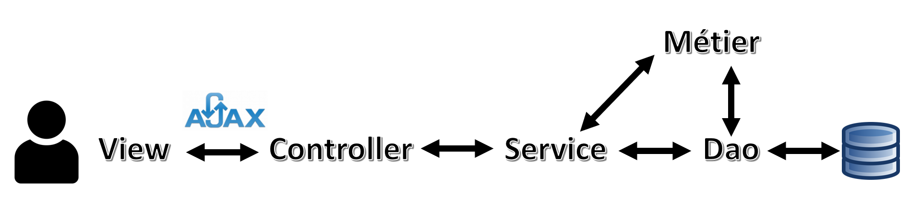

# ABOUT PROJECT
#### [ GestionAppel ] Développement d'un site web en Java : Application de gestion de l'appel en ligne (Inscription, Connexion, )  *( 2021.02.07 ~ 2021.02.11 )*

## 1. Membres de l'équipe

|*Members*|*Contact*|
|:---:|---|
|**Zijing ZHOU**| |
|**Joohyun ANN**| |
|**Tong LIU**| |
|**Fares MEGARI**| |

## 2. Installation du projet
1. Copier URL Github 
2. Import Projet
3. Connexion DB to MySQL
   1. Adapation de hibernate.cfg.xml
      1. hibernate.connection.url
      2. hibernate.connection.username
      3. hibernate.connection.password
      4. hibernate.hbm2ddl.auto (create)
   2. Exécution HQL (GenererBD.java)
   3. Changement de hibernate.cfg.xml - hibernate.hbmdd1.auto (validate)
   4. Changement de chemin d'accès absolu (JustificatifConstant.java)
   5. Configuration de Tomcat
## 3. Présentation du projet

## 4. Structure (MVC pattern)

## 5. Technologie

