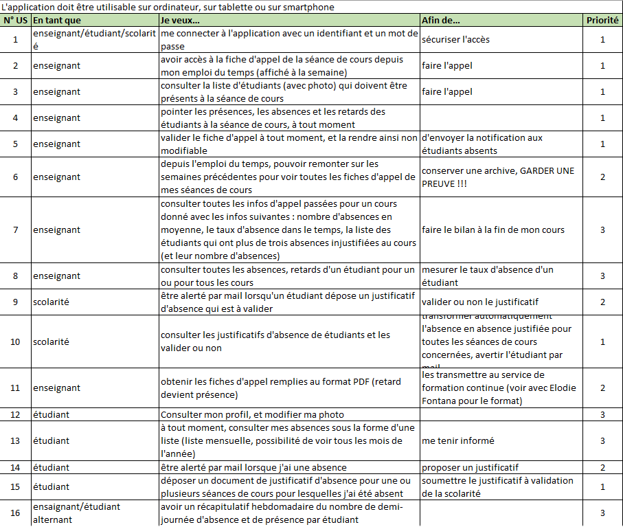
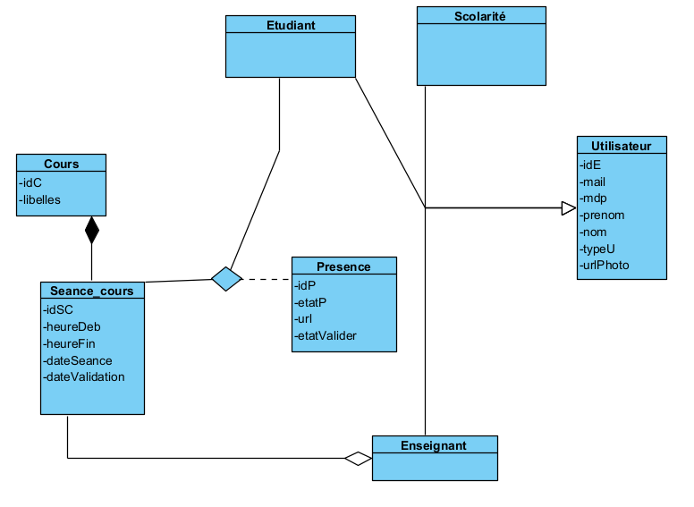

# ABOUT PROJECT
#### [ GestionAppel ] Développement d'un site web en Java : Application de gestion de l'appel en ligne (Inscription, Connexion, )  *( 2021.02.07 ~ 2021.02.11 )*

## 1. Membres de l'équipe

|*Members*|*Contact*|
|:---:|---|
|**Zijing ZHOU**| |
|**Joohyun ANN**| |
|**Tong LIU**| |
|**Fares MEGARI**| |

## 2. Installation du projet
1. Copier URL Github 
2. Import Projet
3. Connexion DB to MySQL
(Notre projet utilise une base de données déploiée sur SKYSQL donc pas de configuration en plus) 
4. Adapdation de chemin d'accès 
      1. Copier le chemin d'accès absolue de dossier "GestionAppel\src\main\webapp\resources\fileJustificatif" (dans IntelliJ, cliquer droit de dossier "fileJustificatif" -> Copy path/reference -> absolute path)
      3. Remplacer le constant "UPLOAD_DIRECTORY" de dao/JustificatifConstant.java en ajoutant "\\" à la fin
      4. Copier le chemin d'accès absolue de dossier "GestionAppel\src\main\webapp\resources\photoProfil"
      5. Remplacer le constant "UPLOAD_DIRECTORY_PHOTO" de dao/JustificatifConstant.java en ajoutant "\\" à la fin
      6. Copier le chemin d'accès absolue de dossier "GestionAppel\src\main\webapp\resources\outPutFiles"
      7. Remplacer le constant "PDF_DIRECTORY" de dao/JustificatifConstant.java en ajoutant "\\" à la fin
7. Configuration de Tomcat

## 3. Présentation du projet
 
&nbsp;L’UFR d’informatique de l’UT1 Capitole souhaite se doter d’un outil de gestion de l’appel en ligne. 
Pour cela, l’UFR souhaite disposer rapidement d’un PoC (Proof of Concept). 
Un recueil des besoins a été mené durant le mois de décembre auprès des deux types d’acteurs impliqués dans le projet : 
- Les étudiants 
- Les enseignants  
- Le recueil des besoins a permis d’élaborer une liste de User stories, point de départ du projet. Il s’agit du backlog de démarrage, il sera enrichi.  

**User Stories** 

## 4. Structure (MVC pattern)

## 5. Technologie

### 5.1 APIs

**Développement**

- JSTL

- javax.servlet

- commons-fileupload

- javax.mail

- org.apache.pdfbox

**Test**

- com.masterxml.jaskson.dataformat

- com.github.servanter

- Junit

## 6. Diagramme de classe (uml)

## 7. Liste des points forts de notre développement
1. Site consultable sur le web (https://gestionappel.herokuapp.com/)
2. Structure des codes optimisée grâce à l'utilisation de MVC pattern
3. Facilité de la reproduction de la Base de donnée (GenererBD.java) en cas d'utilisation de la BDD en local (en s'adaptant hibernate.cfg.xml)
4. Non existence de la redondance des données
5. Stratégie de mapping (SINGLE_TABLE) utilisée (Lecture/écriture la plus performante)

